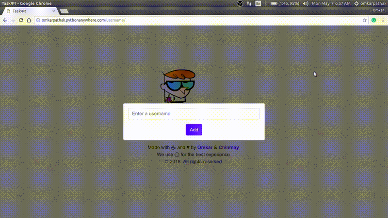

# Django-to-do
A dead simple Django ToDo Web App

This is a sample project that a novice django developer can use to get started.

## Working



## Features

- Dead simple
- Easily add, delete
- Simple UI
- Blazing fast

## Setup

- Download the files from this repo
- Change the directory to the folder where you downloaded files
- For installing required packages, execute the following command in terminal:

    ```bash
    $pip install -r requirements.txt
    ```

- After successful installation execute the following commands:

    ```bash
    $python manage.py migrate
    $python manage.py runserver
    ```

- Visit `127.0.0.1:8000` in your browser to enjoy the awesome app!

Built with ♥ by [`Omkar Pathak`](http://www.omkarpathak.in/)

# Donation

If you have found my softwares to be of any use to you, do consider helping me pay my internet bills. This would encourage me to create many such softwares :)

| PayPal | <a href="https://paypal.me/omkarpathak27" target="_blank"></a> |
|:-------------------------------------------:|:-------------------------------------------------------------:|
| ₹ (INR)  | <a href="https://www.instamojo.com/@omkarpathak/" target="_blank"></a> |
